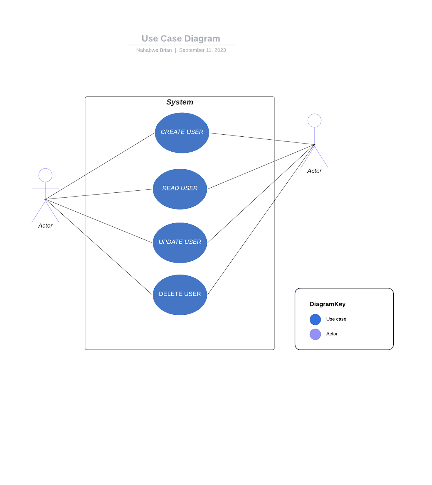
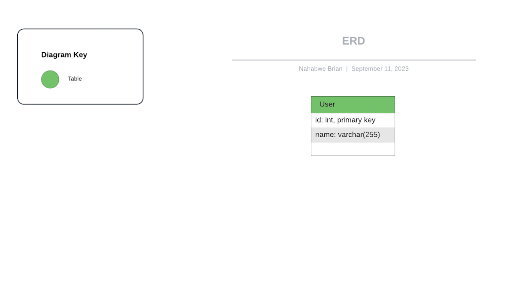

# HNG Backend Stage 2 Task - CRUD Application

This application performs CRUD (Create, Read, Update, Delete) operations on a user domain. It provides a simple API to
manage user records.

## Table of Contents

- [Getting Started](#getting-started)
    - [Use Case Diagram for API Classes](#use-case-diagram-for-api-classes)
    - [Entity-Relationship Diagram (ERD)](#entity-relationship-diagram-erd)
- [Prerequisites](#prerequisites)
    - [Installation](#installation)
- [API Endpoints](#api-endpoints)
    - [Create User](#create-user)
    - [Read User](#read-user)
    - [Update User](#update-user)
    - [Delete User](#delete-user)
- [Request and Response Formats](#request-and-response-formats)
- [Sample API Usage](#sample-api-usage)
- [Known Limitations or Assumptions Made During Development](#known-limitations-or-assumptions-made-during-development)

## Getting Started

### Use Case Diagram for API Classes



This UML diagram provides an overview of the structure of our API classes and their relationships.

### Entity-Relationship Diagram (ERD)



The ERD illustrates the database tables and their relationships in the application.

## Prerequisites

Before you begin, ensure you have met the following requirements:

- **Python:** You must have Python 3.7 or higher installed. If not, you can download and install Python from
  the [Official Python website](https://www.python.org/downloads/).

- **Virtual environment (optional but recommended):** It's a good practice to create a virtual environment for your
  project. You can create one using the built-in `venv`

### Installation

Follow these steps to set up and run the CRUD application:

1. Clone the repository:

   ```bash
   git clone https://github.com/BryanNah/backend-stage-two-task

2. Navigate to the project directory:
   ```bash
   cd backend-stage-two-task

3. Create and activate a virtual environment (optional but recommended):
   ```bash
    python -m venv venv          # Create virtual environment
    source venv/bin/activate    # Activate virtual environment (Linux/macOS)
    venv\Scripts\activate       # Activate virtual environment (Windows)

4. Install the required dependencies:

   ```bash
   pip install -r requirements.txt

5. Start the CRUD application:
   ```bash
   uvicorn task.main:app --port 8000

The application will be accessible at http://localhost:8000.

## API Endpoints

### Create User

    Endpoint: /api
    HTTP Method: POST
    Request Body: JSON
    Response: JSON

### Read User

    Endpoint: /api/{user_id}
    HTTP Method: GET
    Response: JSON

### Update User

    Endpoint: /api/{user_id}
    HTTP Method: PUT
    Request Body: JSON
    Response: JSON

### Delete User

    Endpoint: /api/{user_id}
    HTTP Method: DELETE
    Response: JSON

## Request and Response Formats

### User Creation Request:

    Field: name
    Type: String

### User Response:

    Field: id, Type: Integer
    Field: name, Type: String

## Sample API Usage

Here are some sample API requests and responses:

For information about the API Usage (https://hng-backend-task-tcnq.onrender.com/docs)

### Create User:

* Request
  ``` bash
    POST http://localhost:8000/api
    Content-Type: application/json
    
    {
        "name": "John Doe"
    }
* Response
  ``` bash
  {
    "id": 1
    "name": "John Doe"
  }

### Read User:

* Request
  ``` bash
   GET http://localhost:8000/api/1
* Response
  ``` bash
  {
    "name": "John Doe"
  }

### Update User:

* Request
  ``` bash
    PUT http://localhost:8000/api/1
    Content-Type: application/json
    
    {
        "name": "Nahabwe Brian"
    }
* Response
  ``` bash
  {
    "id": 1
    "name": "Nahabwe Brian"
  }

### Delete User:

* Request
  ``` bash
   DELETE http://localhost:8000/api/1
* Response
  ``` bash
  {
    "details": "User successfully deleted"
  }

## Known Limitations or Assumptions Made During Development

    1. The API assumes that the id field of a user is unique and auto-incrementing.
    2. The API assumes that the name field of a user is a string.
    3. The API does not perform any authentication or authorization.
    4. The database used is SQLite which stores data in the file on local system.